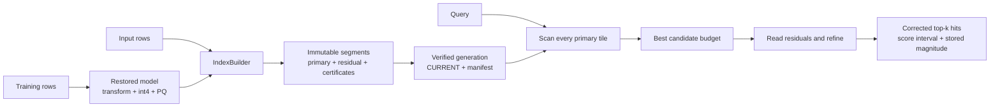

# Spherra

I built Spherra as a local, embedded Rust vector index for 768-dimensional
embeddings. It stores immutable generations on disk, scans compressed primary
codes, refines the best candidates from their residuals, and returns approximate
top-k hits with intervals that enclose each hit's original-space score. Rows are
added offline in atomic commits; there is no server or distributed runtime.

> **Project status:** the local index is implemented and its measured acceptance
> gates pass on an Apple M1 Pro with 32 GiB RAM. The earlier distributed
> database direction is stopped. The authoritative design is the [local index
> design](docs/design/2026-09-13-local-index-design.md), with delivery
> details in the [implementation specification](docs/design/2026-09-13-local-index-implementation-spec.md).

## What I built

| Part | Result |
|---|---|
| Public library | `spherra` exposes `IndexBuilder`, `Index`, cosine search, append, and optional length-aware dot-product search |
| Compression | Two seeded sign/permutation/Hadamard rounds, direct 4-bit direction codes, and PQ96x8 residual refinement |
| Storage | Checked little-endian model, manifest, segment, `CURRENT`, and per-block integrity data with content identities |
| Publication | Staged files are verified and synced before `CURRENT` is published; interrupted commits preserve a valid previous generation |
| Search | A full primary scan keeps a candidate budget, reads residuals only for finalists, and orders by corrected score then row ID |
| Truth | FP64 original-space scores are used as the reference; returned intervals validate the score of each returned row, not exact top-k membership |
| Verification | Scalar differential tests, fault-injected recovery tests, pinned corpora, release benchmarks, and checked fuzz targets |

## Measured results

The current serving correction divides finalist scores by the FP64 length of the
reconstructed compressed vector. It changes no index bytes and requires no
rebuild.

| Workload | Indexed rows | Queries | Recall@10 | Median / p99 |
|---|---:|---:|---:|---:|
| Generated correlated cosine | 1,000,000 | 200 | **0.9255** | **72.31 / 113.56 ms** |
| MS MARCO cosine | 100,000 | 200 | **0.9770** | — |
| Native DPR dot product | 1,000,000 | 1,000 | **0.9234** | **73.01 / 108.24 ms** |

An earlier uncorrected 10M release qualification measured 458.15 ms median and
616.47 ms p99. The corrected serving path has not been rerun for a new 10M
tail-latency claim. These are held-out vector-neighbor measurements, not
published BEIR task scores. See the [benchmark protocol and raw
evidence](docs/benchmarks/README.md) for commands, hashes, and limitations.

## How it works



Creating an index trains a deterministic transform, direct-int4 table, and
PQ96x8 codebook from a bounded calibration set. The builder validates each input
vector, stages immutable segments, writes the manifest and model, verifies every
identity, syncs the files, and publishes `CURRENT` last. A commit is either
visible as a complete generation or remains unpublished.

Opening an index verifies the complete generation before exposing a handle. The
primary direction tiles and the two-byte-per-row stored-magnitude cache stay in
memory. Residual files remain candidate-only and are read positionally. A cosine
query scans every primary row, keeps the best candidate budget using exact Q24
integer scores, refines those candidates, applies reconstruction-length
correction, and returns the final top-k rows. `search_dot_product` uses the same
scan while weighting primary and refined scores by the stored FP16 input length.

## How I built it

1. **Started with a scalar codec oracle.** I implemented the fixed 768-dimensional
   transform, direct-int4 quantization, PQ96x8 residuals, fixed-point scoring,
   and conservative score certificates before adding storage or parallelism.
2. **Made the model restorable.** Quantizer and codebook bytes have stable
   identities, so a reopened index uses exactly the model that built its rows.
3. **Added durable local generations.** Checked containers, manifests, locks,
   atomic publication, bounded descriptors, and fault-injected recovery define
   the library's filesystem behavior.
4. **Built the reference search.** Every primary row is visited, candidates are
   refined from disk, and the result is compared with an independent exact
   FP64 oracle.
5. **Qualified the serving path.** A safe tiled scan kernel passed exact scalar
   differential checks and the M1 latency gates, so a second unsafe SIMD
   toolchain was not introduced.
6. **Measured real workloads.** Hash-pinned SciFact, MS MARCO, DPR, MovieLens,
   and generated corpora cover cosine quality, dot-product quality, memory,
   recovery, norm handling, and reconstruction drift.

## How I tested it

The normal repository gate is:

```bash
bash scripts/ci.sh
cargo test --workspace --locked
cargo clippy --workspace --all-targets --locked -- -D warnings
```

| Verification level | What is checked | Status |
|---|---|---|
| Codec and format | Explicit bytes, restored identities, paired readers, tile decoding, and certificate enclosure | Passing |
| Index library | Builder rules, open validation, append, search, dot-product search, and public API contracts | Passing |
| Durability | Short writes, injected failures, process death, locks, and recovery on local APFS | Passing |
| Serving kernel | 2,073,760 tile scores compared with the checked scalar scorer | Zero differences |
| Retrieval quality | 14,000 recorded final hits checked against original-space truth | Zero enclosure failures |
| Fuzz targets | Checked format, certificate, model, manifest, and `CURRENT` decoders | Builds and bounded no-crash runs; ASan runtime is unavailable on this host |

The full gate currently passes 218 tests with 12 explicitly skipped large
qualifications. Large corpus runs and raw result files are kept under
[`docs/benchmarks`](docs/benchmarks/README.md), rather than being hidden behind
unverifiable headline numbers.

## Use the library

The workspace pins Rust 1.88.0 and edition 2024. Supply finite 768-dimensional
vectors; unreliable norms and values outside the stored FP16 range are rejected.
Training rows are separate from indexed rows unless explicitly pushed.

```rust
use std::path::Path;
use spherra::{CreateOptions, Error, Index, IndexBuilder, SearchOptions, Vector};

fn build_and_search(
    directory: &Path,
    training: &[Vector],
    rows: &[Vector],
    query: &Vector,
) -> Result<(), Error> {
    let mut builder = IndexBuilder::create(
        directory,
        training,
        CreateOptions { seed: 20260804, validation_rows: None },
    )?;
    for row in rows {
        builder.push(row)?;
    }
    let commit = builder.commit()?;

    let index = Index::open(directory)?;
    let result = index.search(
        query,
        SearchOptions { k: 10, candidate_budget: None },
    )?;
    println!("generation {}: {} rows added", commit.generation(), commit.rows_added());
    for hit in result.hits() {
        println!("row {}: score {}, interval {:?}",
            hit.row().get(), hit.score(), hit.interval());
    }
    Ok(())
}
```

`candidate_budget: None` resolves to `max(200, 2*k)`, clamped to the index size.
Search ordering is score descending, then dense row ID ascending. A returned
interval encloses the original-space score for that row while its files remain
intact; it is not a proof that the approximate result is the exact top-k set.

For non-normalized embeddings, the optional method preserves input magnitude:

```rust,no_run
# fn example(index: &spherra::Index, query: &spherra::Vector) -> Result<(), spherra::Error> {
let result = index.search_dot_product(
    query,
    spherra::SearchOptions { k: 10, candidate_budget: None },
)?;
for hit in result.hits() {
    println!("row {}: dot {}, interval {:?}",
        hit.row().get(), hit.score(), hit.interval());
}
# Ok(()) }
```

Drop open `Index` handles before appending. Builders take a nonblocking
exclusive lock, and the commit consumes the builder:

```rust,no_run
# fn append_one(directory: &std::path::Path, row: &spherra::Vector)
#     -> Result<spherra::RowId, spherra::Error> {
let mut builder = spherra::IndexBuilder::append(directory)?;
let row_id = builder.push(row)?;
builder.commit()?;
# Ok(row_id) }
```

## Storage limits and boundaries

- Training is capped at 32,768 rows; a segment at 65,536 rows; and the index at
  4,096 segments or `2^48 - 1` total rows.
- Rows are dense ordinals scoped to one index. Commits report reconstruction
  drift over a bounded deterministic sample.
- The first serving index is a full scan. There is no global HNSW, routing,
  filtering, deletion, compaction, replication, or server API.
- Original vectors are not retained by the index. Original-vector reranking is
  preserved only as a benchmark experiment and is not part of serving.
- Durability is qualified on local APFS with fault injection and process death;
  physical power loss and other filesystems remain unqualified.

## Repository map

| Path | Contents |
|---|---|
| `crates/spherra/` | Public local index, builder, storage, publication, open, search, and recovery |
| `crates/spherra-codec/` | Transform, direct-int4, PQ96x8, fixed-point scoring, certificates, and tile kernel |
| `crates/spherra-format/` | Explicit durable model/segment formats and checked readers |
| `crates/spherra-domain/` | 768-dimensional validation, IDs, and sequence/domain contracts |
| `crates/spherra-testkit/` | Deterministic corpora, exact oracles, machine provenance, and measurement support |
| `crates/spherra-bench/` | Reproducible quality, latency, memory, norm, and dot-product commands |
| `docs/benchmarks/` | Protocols, schemas, raw results, and limitations |
| `docs/design/` | Current local-index contracts plus clearly marked historical direction documents |
| `corpora/` | Hash-pinned corpus descriptors; large vector payloads stay outside Git |
| `fuzz/` | Nightly-only checked decoder targets |
| `scripts/` and `tools/` | CI, dependency policy, corpus builders, audits, and result summaries |

## Where the project is now

Spherra's active product direction is the embedded local library. The earlier
PolarLSM/PolarRouter distributed database design is retained as historical
context, but it is not implemented or part of the current contract. The next
useful measurements are cold-cache behavior under memory pressure and recall on
larger labeled sets at 10M rows. Additional distance metrics are a separate
future decision for workloads whose vector magnitudes carry meaning.
