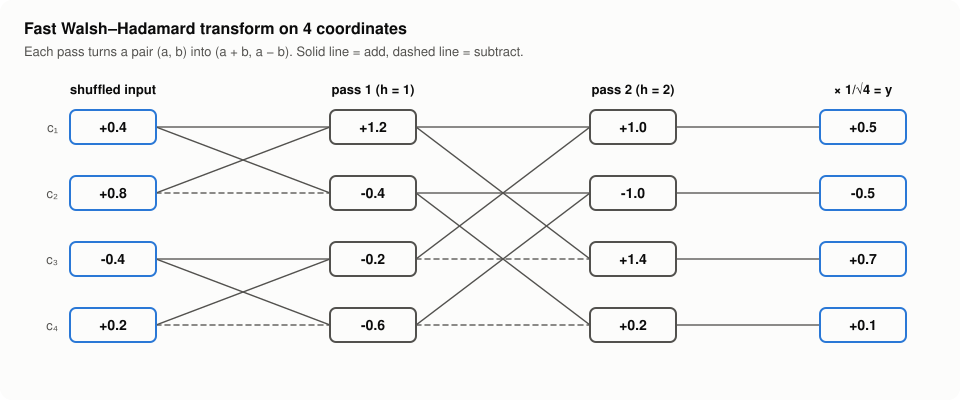
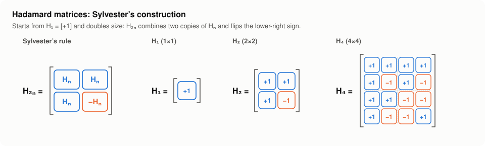
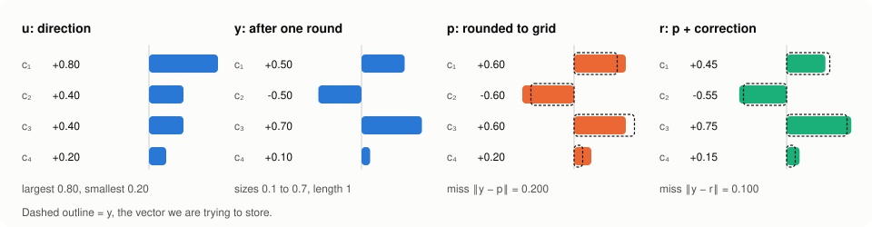
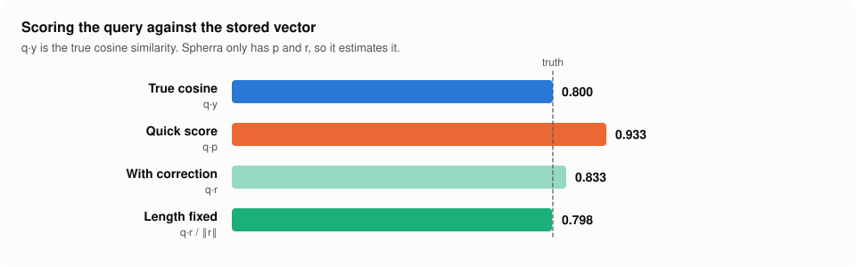

# Spherra

Spherra is a local, embedded Rust vector index for 768-dimensional embeddings.
It shrinks each vector to about one sixth of its size, searches the small
copies, and returns the best matches with a proven range for each score.

This README explains the math by following one small vector with 4 numbers
through every step. Spherra runs exactly the same steps on vectors with 768
numbers; the example is simply smaller so every calculation fits on the page.
Four is the smallest size where the fast Hadamard transform takes more than one
pass, so the example shows the real algorithm, not a stand-in.

<picture>
  <source media="(prefers-color-scheme: dark)" srcset="docs/images/transform-animation-dark.svg">
  
</picture>

## Quick start

Rust 1.88.0, edition 2024. Vectors must be finite and 768-dimensional. Training
vectors teach the index its grid and codebooks; they are not searchable unless
you also push them.

```rust
use std::path::Path;
use spherra::{CreateOptions, Error, Index, IndexBuilder, SearchOptions, Vector};

fn build_and_search(
    directory: &Path,
    training: &[Vector],
    rows: &[Vector],
    query: &Vector,
) -> Result<(), Error> {
    let mut builder = IndexBuilder::create(
        directory,
        training,
        CreateOptions { seed: 20260804, validation_rows: None },
    )?;
    for row in rows {
        builder.push(row)?;
    }
    builder.commit()?;

    let index = Index::open(directory)?;
    let result = index.search(query, SearchOptions { k: 10, candidate_budget: None })?;
    for hit in result.hits() {
        println!("row {}: score {}, range {:?}", hit.row().get(), hit.score(), hit.interval());
    }
    Ok(())
}
```

- `index.search_dot_product(query, options)` also uses each vector's length.
- `IndexBuilder::append(directory)` adds rows later. Drop open `Index` handles
  first.
- Commits are atomic: a crash leaves the previous version readable.

## The problem

An embedding is a list of numbers, called coordinates, that describes a piece of
text or an image. Two embeddings are "similar" when they point in nearly the
same direction. That is measured by the **cosine similarity**: 1 means the same
direction, 0 means unrelated.

A 768-number embedding stored as normal 32-bit floats takes 3,072 bytes.
Ten million of them take 30 GB. Spherra's goal is to store each one in far fewer
bytes while still being able to compute similarity scores that are close to the
real ones.

The plan has two parts:

1. **Reshape** the vector so every coordinate is about the same size. This
   changes nothing about similarity, but it makes the next part work well.
2. **Round** each coordinate to a few allowed values, then store a small
   correction for the rounding mistake.

We will follow this example vector the whole way:

$$x = (4,\ 2,\ 2,\ 1)$$

## Part 1: Reshape the vector

### Step 1: Separate the direction from the length

Cosine similarity only cares about direction. So we split `x` into two pieces:
its **length**, and a **direction** vector of length 1.

$$\lVert x \rVert = \sqrt{4^2 + 2^2 + 2^2 + 1^2} = \sqrt{25} = 5$$

$$u = \frac{x}{\lVert x \rVert} = (0.8,\ 0.4,\ 0.4,\ 0.2)$$

The length 5 is saved separately in 2 bytes, for searches where length matters.

**The problem with `u`:** its coordinates are uneven. The first is 0.8 and the
last is 0.2. In Part 2 every coordinate is rounded, and a vector whose size is
concentrated in a few coordinates suffers the biggest rounding mistakes there.
We want all four coordinates to be about the same size. Steps 2 to 4 do that.

### Step 2: Flip some signs

Multiply each coordinate by a random `+1` or `−1`. Here the random signs are
`(+1, −1, +1, +1)`:

$$(0.8,\ 0.4,\ 0.4,\ 0.2) \rightarrow (0.8,\ -0.4,\ 0.4,\ 0.2)$$

### Step 3: Shuffle the coordinates

Move the coordinates into a random new order. Here the new order is: old
coordinate 3, then 1, then 2, then 4:

$$(0.8,\ -0.4,\ 0.4,\ 0.2) \rightarrow w = (0.4,\ 0.8,\ -0.4,\ 0.2)$$

Signs and order do not change any coordinate's size yet. Step 4 does the
spreading, and Step 4c explains why it needs Steps 2 and 3 first.

### Step 4: Mix with the Hadamard transform

Spherra mixes `w` with the **Hadamard transform**:

$$y = \tfrac{1}{2} H_4\, w = (0.5,\ -0.5,\ 0.7,\ 0.1)$$

Every output coordinate adds or subtracts every input coordinate with equal
weight, and the length stays exactly 1. The **fast Walsh–Hadamard transform**
computes it using only additions and subtractions:

<picture>
  <source media="(prefers-color-scheme: dark)" srcset="docs/images/fwht-dark.svg">
  
</picture>

The largest coordinate drops from 0.8 to 0.7 and two coordinates move to the
middle. The random signs and shuffle matter: mixing `u` without them gives
`(0.9, 0.3, 0.3, 0.1)`, which is worse. Expand the sections below for the full
math.

<details>
<summary><strong>4a. The Hadamard matrix: how it is built and why it keeps lengths</strong></summary>

A Hadamard matrix contains only `+1` and `−1`, and any two different rows agree
in exactly half of their positions. The standard way to build one (Sylvester's
construction) starts from `[1]` and doubles the size each time:

<picture>
  <source media="(prefers-color-scheme: dark)" srcset="docs/images/hadamard-matrix-dark.svg">
  
</picture>

The mix is $y = \tfrac{1}{\sqrt{4}} H_4\, w = \tfrac{1}{2} H_4\, w$. Each output
coordinate is one row of $H_4$ dotted with `w = (0.4, 0.8, −0.4, 0.2)`, then
halved:

| Output | Row of H₄ | Sum | ÷ 2 |
|---|---|---|---:|
| y₁ | (+1, +1, +1, +1) | 0.4 + 0.8 − 0.4 + 0.2 = 1.0 | **0.5** |
| y₂ | (+1, −1, +1, −1) | 0.4 − 0.8 − 0.4 − 0.2 = −1.0 | **−0.5** |
| y₃ | (+1, +1, −1, −1) | 0.4 + 0.8 + 0.4 − 0.2 = 1.4 | **0.7** |
| y₄ | (+1, −1, −1, +1) | 0.4 − 0.8 + 0.4 + 0.2 = 0.2 | **0.1** |

giving the reshaped vector $y = (0.5,\ -0.5,\ 0.7,\ 0.1)$.

Three facts make this a good mixer:

1. **It keeps lengths.** Two different rows agree in `n/2` positions and
   disagree in `n/2`, so their dot product is `0`. Each row dotted with itself is
   `n`. So $H_n H_n^\top = nI$, and $\tfrac{1}{\sqrt n}H_n$ is a rotation. Check:
   $0.5^2 + 0.5^2 + 0.7^2 + 0.1^2 = 1$.
2. **It undoes itself.** $H_n$ is symmetric, so applying $\tfrac{1}{\sqrt n}H_n$
   twice gives back the original vector.
3. **Every output uses every input with equal weight.** Each output is
   $\tfrac{1}{\sqrt n}(\pm w_1 \pm w_2 \pm \dots \pm w_n)$. No input coordinate
   counts more than another.

</details>

<details>
<summary><strong>4b. The fast Walsh–Hadamard transform: the algorithm and why it works</strong></summary>

Multiplying by the matrix, as in the table above, takes $n^2$ multiplications:
16,384 for a 128 × 128 matrix. The **fast Walsh–Hadamard transform** (FWHT) gets
the same answer using only additions and subtractions, without ever building the
matrix:

```text
for half-width h = 1, 2, 4, …, n/2:
    for every pair of positions (a, a + h) inside each 2h-wide group:
        (left, right) ← (left + right, left − right)
finally multiply everything by 1/√n
```

Here it is on `w`, matching the diagram above:

| Pass | Pairs | Calculation | Result |
|---|---|---|---|
| Start | | | (0.4, 0.8, −0.4, 0.2) |
| h = 1 | (1, 2) and (3, 4) | (0.4 + 0.8, 0.4 − 0.8, −0.4 + 0.2, −0.4 − 0.2) | (1.2, −0.4, −0.2, −0.6) |
| h = 2 | (1, 3) and (2, 4) | (1.2 − 0.2, −0.4 − 0.6, 1.2 + 0.2, −0.4 + 0.6) | (1.0, −1.0, 1.4, 0.2) |
| × 1/√4 | | | **(0.5, −0.5, 0.7, 0.1)** |

This matches the matrix result exactly. **Why it works:** a pass with
half-width `h` applies $H_2$ to every pair of positions `h` apart. Look at
Sylvester's rule: $H_{2n}$ combines two copies of $H_n$ by sum and difference.
Pass `h = 1` builds the $H_2$ mixing inside each pair. Pass `h = 2` combines two
already-mixed pairs by sum and difference, which is exactly how $H_4$ is built
from $H_2$. Each further pass doubles the size again.

**Cost:** there are $\log_2 n$ passes, each doing $n/2$ add-and-subtract steps.
For a 128-coordinate block that is 7 passes × 64 steps = **448** steps instead
of 16,384 multiplications. Spherra's code for this is
[`hadamard_128`](crates/spherra-simd/src/scalar.rs).

</details>

<details>
<summary><strong>4c. Why the random signs and shuffle matter</strong></summary>

Now the result:

| | c₁ | c₂ | c₃ | c₄ | Largest | Smallest |
|---|---:|---:|---:|---:|---:|---:|
| `u` (before) | 0.8 | 0.4 | 0.4 | 0.2 | 0.8 | 0.2 |
| `y` (after) | 0.5 | −0.5 | 0.7 | 0.1 | 0.7 | 0.1 |

The largest coordinate dropped and two coordinates reached the middle. But look
at what happens if we skip Steps 2 and 3 and mix `u` directly:

$\tfrac{1}{2}H_4\,(0.8,\ 0.4,\ 0.4,\ 0.2) = (0.9,\ 0.3,\ 0.3,\ 0.1)$

That is **worse** than `u`. Because the Hadamard transform undoes itself, it
turns some even vectors into spiky ones just as easily as it turns spiky ones
into even ones. The extreme cases:

$\tfrac{1}{2}H_4\,(1,\ 0,\ 0,\ 0) = (0.5,\ 0.5,\ 0.5,\ 0.5) \qquad \tfrac{1}{2}H_4\,(0.5,\ 0.5,\ 0.5,\ 0.5) = (1,\ 0,\ 0,\ 0)$

A fixed mixer always has inputs it handles badly. Random signs make sure no
input is reliably bad. With random signs $s_j = \pm 1$, output coordinate `i` is

$y_i = \frac{1}{\sqrt n}\sum_j H_{ij}\, s_j\, u_j$

a sum whose terms have random coin-flip signs. Its average is `0`, and its
average square is $\tfrac{1}{n}\sum_j u_j^2 = \tfrac{1}{n}$, **no matter what
`u` looks like**. Every output coordinate has the same expected size,
$1/\sqrt n$.

In 4D, that promise is weak. There are 16 sign choices × 24 orders = 384 random
choices for our `u`. Exactly half of them produce sizes `(0.1, 0.5, 0.5, 0.7)`
like our `y`, and the other half produce the worse `(0.1, 0.3, 0.3, 0.9)`. A sum
of only four random terms can still land far from average.

With more coordinates, the sum has more random terms and lands close to its
average far more reliably. Hoeffding's inequality puts a number on it:

$P\left(\lvert y_i \rvert > t\right) \le 2\,e^{-n t^2 / 2}$

For a 128-coordinate block, a coordinate above `0.3` has a probability of at
most `0.0063`. For comparison, the average coordinate size is
$1/\sqrt{128} \approx 0.088$, and before mixing a coordinate could be as large
as `1`.

This bound is for **one** coordinate. Across a whole block of 128 coordinates,
it allows up to 128 × 0.0063 ≈ 0.8 coordinates above `0.3` on average. So a
large coordinate can still appear now and then. The bound says large
coordinates are rare, not that they never happen.

</details>

<details>
<summary><strong>4d. How Spherra uses it on 768 coordinates</strong></summary>

Spherra splits the 768 coordinates into **6 blocks of 128** and runs the FWHT on
each block separately. One **round** is:

1. flip each of the 768 signs at random (Step 2),
2. shuffle all 768 coordinates at random (Step 3),
3. run the FWHT on each of the 6 blocks (Step 4).

A block can only spread out what is already inside it. After one round, some
blocks can hold much more of the vector than others. So Spherra runs **two
rounds** with different random signs and shuffles. The second shuffle scatters
every block's coordinates across all six blocks, and the second mix spreads them
out again.

An extreme test: a vector with all its size in 3 of the 768 coordinates, sent
through two rounds with one random seed:

| | Nonzero coordinates | Share of squared length in blocks 1–6 |
|---|---:|---|
| Input | 3 of 768 | 1.00, 0, 0, 0, 0, 0 |
| After round 1 | 384 of 768 | 0, 0, 0.93, 0.06, 0, 0.01 |
| After round 2 | 749 of 768 | 0.19, 0.17, 0.17, 0.14, 0.14, 0.18 |

After round 1, one block holds 93% of the vector and half the coordinates are
still zero. After round 2, every block holds close to its fair 1/6 share.

The random signs and shuffles come from a saved seed, so every stored vector
and every query goes through exactly the same two rounds.

</details>

### Why reshaping is allowed

Sign flips, shuffles and $\tfrac{1}{\sqrt n}H_n$ are all rotations or mirror
flips of space. They never stretch anything, so the angle between any two
vectors stays the same. If the query is reshaped the same way, its cosine
similarity with every stored vector is unchanged. Spherra never undoes the
reshaping; it searches directly in the reshaped space.

## Part 2: Store the vector in a few bits

<picture>
  <source media="(prefers-color-scheme: dark)" srcset="docs/images/compression-dark.svg">
  
</picture>

### Step 5: Round each coordinate to a grid

Instead of storing exact numbers, we only allow a few values per coordinate.
This example allows 4 values, each with a number called its **code**:

| Code | 0 | 1 | 2 | 3 |
|---|---:|---:|---:|---:|
| Value | −0.6 | −0.2 | 0.2 | 0.6 |

Each coordinate of `y` is rounded to the nearest allowed value:

| Coordinate | Value in `y` | Nearest allowed value | Code stored |
|---|---:|---:|---:|
| 1 | 0.5 | 0.6 (0.1 away) | 3 |
| 2 | −0.5 | −0.6 (0.1 away) | 0 |
| 3 | 0.7 | 0.6 (0.1 away) | 3 |
| 4 | 0.1 | 0.2 (0.1 away) | 2 |

The rounded vector is `p = (0.6, −0.6, 0.6, 0.2)`, and all we store is
`(3, 0, 3, 2)`: 2 bits per coordinate. The mistake is:

$$\lVert y - p \rVert = \sqrt{0.1^2 + 0.1^2 + 0.1^2 + 0.1^2} = 0.2$$

Notice how the reshaping helped: every coordinate of `y` landed near an allowed
value. Spherra allows 16 values per coordinate (4 bits each), chosen separately
for each coordinate by spreading them evenly through the values seen in training
vectors. That gives 768 × 4 bits = **384 bytes**.

### Step 6: Store a correction for the rounding mistake

The mistake left over from rounding is:

$$e = y - p = (-0.1,\ 0.1,\ 0.1,\ -0.1)$$

Instead of storing `e`, Spherra uses **product quantization**. It cuts `e` into
pieces and, for each piece, stores the position of the closest entry in a list
of typical mistakes for that piece, called a **codebook**. Codebooks are
learned once from training vectors with k-means clustering.

Here `e` is cut into two pieces of two numbers, each with its own 4-entry
codebook:

| Entry | Codebook A (for coordinates 1–2) | Distance from (−0.1, 0.1) | Codebook B (for coordinates 3–4) | Distance from (0.1, −0.1) |
|---:|---|---:|---|---:|
| 0 | (0.05, 0.05) | 0.158 | **(0.15, −0.05)** | **0.071** |
| 1 | **(−0.15, 0.05)** | **0.071** | (−0.05, 0.15) | 0.292 |
| 2 | (0.05, −0.15) | 0.292 | (0, 0) | 0.141 |
| 3 | (−0.1, −0.1) | 0.200 | (−0.1, −0.1) | 0.200 |

We store entry `1` for piece A and entry `0` for piece B. Joining the two chosen
entries gives the correction `ê`, and adding it to `p` rebuilds the vector:

$$\hat e = (-0.15,\ 0.05,\ 0.15,\ -0.05)$$

$$r = p + \hat e = (0.45,\ -0.55,\ 0.75,\ 0.15)$$

The mistake halves, from 0.2 to $\lVert y - r \rVert = 0.1$.

Spherra cuts the 768 numbers into **96 pieces of 8**, each with its own
codebook of 256 entries. One byte picks one of 256 entries, so the correction
costs **96 bytes**.

### What gets stored

| | 4D example | Spherra (768 numbers) |
|---|---|---:|
| Original vector | 4 floats = 16 bytes | 3,072 bytes |
| Rounded codes (Step 5) | `(3, 0, 3, 2)` = 8 bits | 384 bytes |
| Correction codes (Step 6) | `(1, 0)` = 4 bits | 96 bytes |
| Length and flags (Step 1) | 5 | 4 bytes |
| **Total** | | **484 bytes, 6.3× smaller** |

To rebuild a vector: look up the rounded values from the codes to get `p`, look
up the codebook entries to get `ê`, and add them to get `r`.

## Searching

<picture>
  <source media="(prefers-color-scheme: dark)" srcset="docs/images/search-dark.svg">
  
</picture>

Take the query $z = (2,\ 1,\ 0,\ 2)$, with length 3. Its true cosine similarity
with `x` is

$$\frac{z \cdot x}{\lVert z \rVert\,\lVert x \rVert} = \frac{8 + 2 + 0 + 2}{3 \times 5} = 0.800$$

The query goes through Steps 1 to 4 with the same random signs and shuffle,
giving `q = (0.500, −0.833, 0.167, 0.167)`. Because reshaping keeps angles,
`q·y` is also 0.800. Spherra never has `y`, so it estimates the score in three
rounds:

| Round | Score | Example | Done for |
|---|---|---:|---|
| 1. Quick score | `q·p` | 0.933 | every stored vector |
| 2. Add the correction | `q·r` | 0.833 | the best 200 from round 1 |
| 3. Fix the length | `q·r / ‖r‖` | 0.798 | the same 200 |

Round 3 is needed because `r` is not exactly length 1 (here `‖r‖ = 1.044`), and
a longer or shorter vector skews the score. Dividing by its length removes that
skew. The final results are sorted by the round 3 score.

**Proven score ranges.** The Cauchy–Schwarz inequality says
$\lvert q \cdot y - q \cdot r \rvert \le \lVert q \rVert \, \lVert y - r \rVert$.
Spherra records the largest rebuild mistake `‖y − r‖` when it writes vectors to
disk, so every result comes with a range that is guaranteed to contain its true
score.

## How well it works

On an Apple M1 Pro, compared with exact search
([details](docs/benchmarks/README.md)):

| Workload | Vectors | Recall@10 | Median / p99 |
|---|---:|---:|---:|
| Generated cosine | 1,000,000 | 0.9255 | 72 / 114 ms |
| MS MARCO cosine | 100,000 | 0.9770 | — |
| DPR dot product | 1,000,000 | 0.9234 | 73 / 108 ms |

Recall@10 is the share of the true 10 closest vectors that Spherra returns.
