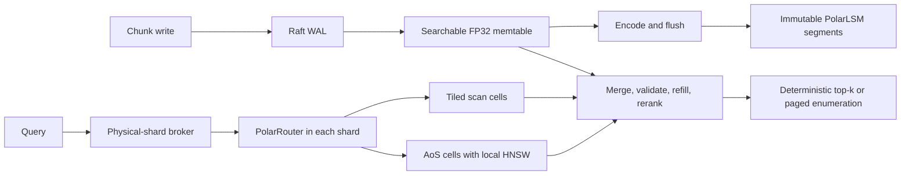

# Spherra: PolarLSM + PolarRouter approved production design

> **Superseded for current implementation (2026-09-13).** This document records
> the stopped distributed-database direction. The approved
> [local index design](2026-09-13-local-index-design.md) and
> [implementation specification](2026-09-13-local-index-implementation-spec.md)
> govern current work. Historical codec/certificate material remains reference;
> residuals remain candidate-only disk/page-cache data. Do not resume the
> distributed milestones from this document.

Status: **R7 approved; Spherra branding amendment applied on 2026-08-04 without behavioral changes**
Revision: R7 plus naming amendment (frozen architecture; benchmark-selected constants remain provisional)
Target: 768-dimensional RAG and semantic-search embeddings

## 1. Outcome

Build **Spherra**, one database made from two cooperating components:

- **PolarLSM** provides durable writes, immediate search visibility, versioning, deletion, immutable storage, compaction, and replication.
- **PolarRouter** narrows each query to promising directional cells, applies filters, and chooses a scan or a cell-local HNSW index.

The stored vector form is explicitly polar: an FP16 magnitude plus a compressed unit direction. The direction is encoded directly after an orthogonal TurboQuant-style preconditioner. It is **not** represented as 767 recursively dependent hyperspherical angles.

Spherra is the product and repository name. Its public command is `spherra`, and its planned first-party Rust packages use the `spherra-*` prefix. PolarLSM and PolarRouter remain subsystem names. TurboQuant names only the external research inspiration; Spherra's database design, implementation, and experiments are independent project work.

That choice is evidence-driven. At the same 4-bit/component budget, the prototype found no meaningful retrieval-quality advantage for recursive angles, while direct direction codes were consistently faster. The design keeps TurboQuant's useful ideas—randomized orthogonal conditioning, scalar quantization, a high-precision query, and a small residual correction—without putting a serial angle recursion in the serving path. This direction is consistent with the [TurboQuant paper](https://arxiv.org/abs/2504.19874) and [Google Research overview](https://research.google/blog/turboquant-redefining-ai-efficiency-with-extreme-compression/); the database-specific architecture and experiments here are this project's design.



## 2. Product contract

- The first implementation runs on an Apple M1 Pro with 8 cores (6 performance and 2 efficiency), 32 GiB unified memory, and a 1 TB SSD.
- The local target is 10 million chunks. Twenty-five million is a stretch target that receives no service-level claim until it passes the same acceptance harness.
- A billion vectors is a clustered deployment, never a single-laptop promise.
- Ingestion chunks documents outside the database. Each chunk has a 128-bit `chunk_id`, parent `document_id`, `chunk_ordinal`, source URI, metadata, one vector, and optional inline text capped at 16 KiB. Source documents remain external.
- Query modes are cosine top-k, semantic cone, stored-radius range, and hybrid vector + radius + metadata.
- After a successful acknowledgement, the chunk participates in every later session-consistent search before any flush is required.
- There is no global HNSW. HNSW is optional, immutable, and local to selected direction cells.
- IDs, sequence fields, framing, and format versioning are billion-capable from the first release.

## 3. Record and scoring model

### 3.1 Collection contract

A collection fixes the tenant, embedding model and version, dimension 768, metric/scorer version, and allowed codec generations.

At ingestion:

- Reject NaN, infinity, and norms above the largest finite FP16 value.
- Store the original L2 norm once as FP16.
- Promote that stored FP16 value to FP32 for inclusive radius comparisons against FP32 query bounds. Never round query bounds to FP16.
- Mark vectors below `min_norm_epsilon` as `DIRECTION_UNRELIABLE`. They are excluded from directional training, routing, cosine, cone, and any hybrid query containing a vector predicate. They remain available to ID, metadata-only, and radius-only queries in a non-routable partition.

### 3.2 PolarCode

The provisional v1 code is:

| Column | Bytes/vector | Residency | Purpose |
|---|---:|---|---|
| Direct int4 direction | 384 | Resident | 768 transformed coordinates at 4 bits each |
| Radius and flags side word | 4 | Resident | FP16 radius plus flags/reserved bits |
| PQ96x8 residual | 96 | SSD/page cache | Candidate-only refinement |

`codec_id`, `scorer_version`, dimension, transform seeds, quantizer tables, and `layout_id` are block headers, not repeated per vector. IDs, versions, and residuals are parallel columns.

The preconditioner has two independently seeded rounds. Each round applies sign flips, one global permutation, then six normalized 128-point fast Hadamard transforms. The composition is orthogonal and mixes information across the original blocks without padding 768 dimensions to 1024.

Let `T` be that transform. The query is L2-normalized before applying `T`. The direct codec reconstructs `p`; the provisional PQ96x8 residual reconstructs `e`; and `y = p + e`. The score is exactly:

```text
s_hat(q, x) = dot(T(normalize(q)), y)
```

There is no learned affine correction and no assumption that `y` has unit norm. Displayed scores may be clamped to `[-1, 1]`, but ranking and thresholds use the unclamped value.

The comparison scale belongs to `scorer_version`, not `codec_id`. Every codec generation admitted to one collection must emit scores and bounds on the same scale. A codec that needs a different scale requires a new collection generation and re-ingestion. Query and residual lookup tables use fixed-point entries and int64 accumulation. Separate constructive bounds cover primary-only rounding (`eta_primary`) and primary-plus-residual rounding (`eta_rerank`).

FP32 vectors may be retained in cold external storage. Without them, a codec migration requires re-embedding/re-ingestion; lossy transcoding is forbidden. A sampled FP32 corpus is always retained for quality validation.

## 4. Placement, version truth, and immutable storage

### 4.1 Sharding

The default virtual-shard key is:

```text
hash(tenant, collection/model, document_id)
```

All chunks and document deletes for one document therefore stay in one vshard. Physical shards own multiple vshards. Direction cells are only within-vshard physical partitions; they are never the database shard key or the LSM merge key.

### 4.2 Truth indexes

Each vshard has:

- A leveled primary-key LSM keyed by `(tenant, collection, chunk_id)`, whose value is the latest `put_seq` and `(segment_id, segment_ordinal)` or a tombstone.
- A document-tombstone LSM keyed by `document_id`. A tombstone at sequence `D` suppresses chunk puts with `put_seq <= D`; later puts are live.

Both indexes retain snapshot-readable historical versions until the snapshot reclamation floor passes them; a latest-value-only implementation would be incorrect.

`chunk_ordinal` is a chunk's position in its document. `segment_ordinal` is its physical row in a segment.

### 4.3 Vector segments and visibility

Leader-built, immutable, size-tiered vector segments contain spherical-k-means direction cells and parallel columns for chunk/document IDs, chunk ordinal, put sequence, radius/flags, primary code, residual, stable blob ID, metadata, and checksums. A segment contains at most 16,777,216 rows; the on-disk segment ordinal is uint32.

Sequence-tagged live/deleted bitmap generations and recent deletion deltas provide snapshot liveness. An update atomically publishes its new put and deletion of the previous pointer. A capped, published hash handles recent document tombstones until flush/compaction folds them into bitmaps. Exceeding its entry or byte limit forces folding and write backpressure.

HNSW may traverse deleted nodes but never emit them. More than 15% deleted nodes triggers a leader-side rebuild at the next compaction by default; workload tests may choose a stricter threshold. Followers never schedule compaction.

A returned candidate must match the snapshot's primary-key pointer and sequence and must not be covered by a chunk or document tombstone. Bitmaps remove the common stale rows. Primary-key/document checks are mandatory for heap admissions and final rerank, with a default budget of 4,096 validations per query per physical shard. When that budget is exhausted, the engine falls back to a bitmap-safe scan/refill or returns `RESOURCE_EXHAUSTED`; it never emits unvalidated data.

### 4.4 Memtables and compaction

The mutable memtable stores the normalized FP32 direction, FP16 radius, IDs, text reference/data, metadata, and sequence state. This makes newly acknowledged rows exactly searchable without waiting for quantization. A frozen memtable remains FP32-searchable while the leader builds PolarCodes, residuals, cells, certified bounds, and an immutable segment. WAL retention ends only after the matching manifest install.

Memtable bytes and at most two frozen memtables are bounded inside the shared 2 GiB working-memory allowance. The exact byte threshold is selected by the ingestion and query gates.

The PK LSM is leveled by chunk ID; vector segments are size-tiered. No code is transcoded during compaction, and blocks from different codec generations remain separate. Vector and blob compaction both operate in bounded partitions: for live managed bytes `L`, one partition's staged output `S` must keep `L + S <= 1.25L`. Tombstones and dedup state are reclaimed only after older local segments have been rewritten and installed and the local snapshot floor has passed them.

## 5. Replication, immediate visibility, and recovery

### 5.1 Replicated state

Raft replicates logical puts and deletes, and every replica applies committed operations to searchable memtables. The leader alone builds sealed immutable files. It ships identical content-hashed files to followers, obtains a staging quorum, and then commits a `MANIFEST_INSTALL` record. Applying that record atomically installs the exact files/manifest and retires corresponding memtable and log ranges.

Segment IDs, segment ordinals, and manifest generations are stable across a replica group. A follower fetches required files before applying the install and cannot advance its applied/visible watermark beyond it. A follower that remains stalled raises an operational alarm and repair/fetch metrics.

Staged files count against every replica's headroom. TTL plus manifest-generation reachability reclaims an uncommitted stage after leader failure. A replica under pressure may refuse or defer staging; the leader requires a quorum. A committed content hash may be fetched from any replica that holds it. Old installed files are reclaimed locally after replacement and the local snapshot floor.

### 5.2 Sequences and acknowledgement

The consistency scope is `(tenant, collection/model, vshard)`. Logical `put_seq` is 64 bits: a 16-bit lineage epoch and 48-bit committed application index. It is monotonic along a vshard lineage and persisted by the state machine.

A single-vshard batch occupies a contiguous sequence range and publishes atomically. Cross-vshard atomic requests are rejected. A non-atomic multi-document request returns per-item success/error and `(vshard, seq)`.

Write acknowledgement order is normative:

1. Validate and assign sequence.
2. Append a framed WAL entry.
3. Reach stable quorum commit.
4. Atomically publish PK, vector, tombstone, and mask state in a searchable memtable snapshot.
5. Advance `visible_seq` only through the highest contiguous committed-and-published sequence.
6. Return `(vshard, seq)`.

Search snapshots only `visible_seq` and merge mutable/frozen memtables with installed segments. This is the immediate-visibility guarantee.

A session-consistent search attaches a vector of `(vshard, minimum_seq)` tokens. A replica waits or forwards until each minimum is visible. Without tokens, the involved vshards route to their leaders. Watermark tokens do not pin history. The system does not claim cluster-wide linearizability.

### 5.3 Vshard split

A split is a maintenance operation with writes quiesced at the split point. Children use `parent_epoch + 1` and reset their local index, so every child sequence follows every parent sequence. Before publishing new routing, the leader physically partitions the parent's segments, bitmaps, PK/document state, and blob extents into disjoint content-hashed file sets and installs child manifests. No file, extent, or bitmap is shared by two Raft groups.

Each child records `(parent_vshard, parent_seq_at_split)`. A parent token at or below the split maps to both children after their inherited prefix is installed. A token above the split is impossible. V1 supports splits, not merges, and rejects writes before either sequence field can overflow.

### 5.4 WAL and durable files

WAL frames contain length, type, vshard, sequence/range, operation ID, payload, and CRC. Recovery stops at the first bad/torn tail and replays entries after the durable checkpoint in sequence order.

Client deduplication uses a separate `(tenant, collection, client_id, op_id)` keyspace whose value includes the result and `(vshard, seq)`. It is retained for the longer of 24 hours or the tombstone/replay safety floor. Older retries are rejected. WAL replay is idempotent by sequence/checkpoint.

The durability adapter uses `F_FULLFSYNC` for stable WAL/SST writes on macOS and `fdatasync`/`fsync` as appropriate on Linux. Manifest publication syncs the new file, atomically renames it, then syncs the parent directory. Ordered files are never mmap-written; only sealed files are read-mapped. WAL records and 64 KiB SST/blob blocks carry CRCs, verified on first touch and by background scrub. Corruption quarantines the affected data and triggers replica repair.

## 6. Blob storage and bounded snapshots

Vector rows store only a stable 128-bit cryptographic `blob_id`, with collision verification. A replicated immutable blob-location LSM maps it to `(extent content hash, offset, length, CRC)`. Text fetches use a paged lookup; Bloom filters and a bounded block cache are resident, while the full location index remains on SSD.

Blob GC marks roots from installed manifests, mutable/frozen source generations, and snapshot leases. Leases pin every source generation needed by their cursors, not only the named manifest. At a default 30% garbage ratio GC copies live data in bounded partitions, builds a replacement location-index generation, stages identical extents/index files on a quorum, and atomically publishes both through `MANIFEST_INSTALL`. Vector columns do not change. Old locations/extents are reclaimed after the local snapshot floor.

Enumerations use server-held snapshot leases, separate from consistency tokens:

- Default TTL: 5 minutes.
- Renewable maximum: 30 minutes.
- Default cap: 1,024 pins/process, plus per-tenant and retained-byte limits.
- Continuation contents: lease ID, manifest generation, serving replica, and source cursors.
- Resume elsewhere redirects to the pinned replica. Missing, expired, or revoked leases return `SNAPSHOT_EXPIRED` and require a restart.
- If a retained-byte or 1.25x amplification bound would be breached, the server may revoke the oldest/largest leases early.

## 7. Certified pruning and PolarRouter

### 7.1 Error certificate

During initial flush, while the original normalized FP32 vector `x` exists, compute exhaustively for every block:

```text
epsilon_primary = max ||T(x) - p||2 + eta_primary
epsilon_rerank  = max ||T(x) - y||2 + eta_rerank
```

For normalized `q`, Cauchy-Schwarz then certifies:

```text
|dot(q, x) - s_hat(q, x)| <= epsilon
```

Bounds are outward-rounded on the scorer's comparison scale. A sampled maximum is never called certified.

Exact recomputation of epsilon or a cell radius is permitted only when original directions are present. Otherwise compaction inherits conservatively:

```text
epsilon_child = max(epsilon_source_blocks)
rho_child = max(angle(c_child, c_source) + rho_source)
```

Recomputing from decoded `p` or `y` is forbidden. A bound that exceeds the codec's drift ceiling loses safe-pruning eligibility until refreshed from originals or re-ingested.

### 7.2 Direction cells and stopping

For centroid `c`, original maximum angular radius `rho`, and normalized query `q`, a cell's true-score upper bound is:

```text
U = cos(max(0, angle(q, c) - rho))
```

Evaluate it with conservative outward rounding. Top-k may skip the cell only when `U < Lk`, where `Lk` is the kth-largest lower-confidence value `s_hat - epsilon_rerank` among examined candidates. This certifies that no unseen vector has true score above `Lk`; it is an error certificate, not an exact-top-k claim. Missing/overly loose bounds require fixed-fanout approximate search or exhaustive cells.

For a cone threshold `tau`, safely skip only when `U < tau`. After rerank, emit candidates with `s_hat + epsilon_rerank >= tau`; this preserves recall relative to stored originals while allowing false positives unless FP32 verifies them. The faster fanout/threshold-expansion cone mode is explicitly approximate.

PolarRouter combines spherical cells, centroid adjacency, optional telemetry-earned logarithmic radius bands, and segment-local metadata postings. Platform math may change approximate traversal, so replicas are not promised identical approximate result sets. Final comparison scores and exhaustive stored-code conformance paths are deterministic; continuations remain replica-pinned.

## 8. Query execution

Sources are mutable/frozen memtables, segment scans, and optional per-cell HNSW graphs.

Each source initially produces:

```text
k_prime = ceil(alpha * k) + delta
```

ordered candidates. The engine applies snapshot validation, filters, and residual reranking. It pulls another page while fewer than `k` valid results remain or any source's remaining upper bound can beat the kth result. It stops only with `k` validated results whose kth lower bound dominates every source bound, or when all sources are exhausted. Stale versions therefore cannot make the result silently under-fill.

HNSW frontier exhaustion is never treated as a certified remaining upper bound. A certified query retains the enclosing cell bound and falls back to exhaustive cell scoring when that bound can still win; stopping on the graph alone is an explicitly approximate profile.

Cone and vector-hybrid enumeration is ordered by score descending and then `chunk_id`. Radius-only enumeration defaults to stored radius ascending and then `chunk_id`, with descending radius available explicitly. Every enumeration requires a result cap and returns a leased continuation token. Thresholds are inclusive.

The filter planner estimates live posting cardinality. At low selectivity it scores the filtered live ordinals directly. Otherwise it prefilters a scan or adaptively expands ANN search, falling back to a filtered scan when needed to fill `k`.

The broker fans out once per physical shard owning collection vshards, supplies session watermarks, and merges using `(comparison_score, chunk_id)`.

## 9. Layout and adaptive HNSW

There is exactly one primary representation per block—never permanent AoS plus SoA duplication. `layout_id` is versioned.

- Scan blocks default to `TILED_SOA_32`: the prototype measured a 24% scan improvement over AoS with a 7.5% random-access penalty.
- HNSW blocks use AoS because random access was faster.
- Full SoA had the fastest full scan, but it is not the default because filtered/single-vector access crosses 768 distant streams and that partial/random behavior is not validated. It remains eligible for proven scan-only blocks.
- Tiled-SoA 64 remains an eligible benchmark alternative.

Only leader compaction changes a block layout, without retaining a duplicate. Production NEON/LUT kernels must revalidate the prototype choices.

A compaction-time cost model chooses scan versus immutable cell-local HNSW. A graph is admitted only when it wins latency at equal recall and concurrent QPS within its memory allowance. It indexes primary scores, returns oversampled candidates for residual rerank, uses uint32 segment ordinals, and rebuilds rather than mutating.

## 10. Capacity and backpressure

Steady-state process RSS is capped at 20 GiB. Preserve at least 4 GiB for OS/page-cache headroom and at least 15% of the SSD as free space.

| Resident item | Budget/vector | 10M | 25M |
|---|---:|---:|---:|
| Primary direction + side word | 388 B | 3.88 GB | 9.70 GB |
| PK filters/cache, masks, router, recent tombstones/dedup, blob-location cache | 48 B | 0.48 GB | 1.20 GB |
| Optional HNSW worst-case allowance if every vector is indexed | 160 B | 1.60 GB | 4.00 GB |
| Shared memtable/query/compaction work | — | <=2 GB | <=2 GB |
| **Worst modeled RSS** | — | **7.96 GB** | **16.90 GB** |

The full PK and blob-location indexes are not resident. The blob-location index costs roughly 32 B/blob on SSD before compression and is counted in collection storage quota. The 96-byte residual costs 0.96 GB at 10M or 2.40 GB at 25M on SSD/page cache and is fetched only for candidates. Text/blob bytes are SSD-resident or external and have collection quotas.

Bound WAL/group commit, mutable bytes, frozen memtables, query concurrency/fanout, candidate validation/rerank, snapshot pins, HNSW builds, staging, and compaction partitions. WAL/search outrank background work. Throttle and then reject writes before memory, replication lag, durability, amplification, or disk-headroom limits fail.

If int4 plus residual fails its quality gates, int8 is a new codec generation and the conservative laptop stretch target becomes 12M. Although static RSS could fit more, the lower target protects scan bandwidth and page/blob/graph headroom. Measurement alone may raise it. Billion-scale capacity adds shards and replicas.

## 11. Acceptance gates before v1 freeze

The architecture is frozen. The following codec, layout, index, and SLO choices are not frozen until they pass:

### 11.1 Quality

- Several real 768D embedding corpora plus synthetic datasets.
- Recall@10 at least 0.90 against exact FP32 after residual rerank.
- Fast/approximate cone recall at least 0.95 at declared selectivities. The certified cone path instead targets recall 1.0 relative to the stored original and may return false positives.
- Filtered recall across selectivity bands.
- Oversampling and validation remain inside memory budgets.

### 11.2 Provisional 10M performance targets

- Hot-cache p95 <=100 ms at 5 sustained QPS with 4 clients.
- Warm-cache p95 <=250 ms at 2 QPS.
- At least 1,000 vector puts/second with grouped durability while mixed search stays within 2x its no-ingest p95.
- Report cold cache separately.
- The 25M stretch target has no SLO until it passes this same harness.

### 11.3 Correctness and operations

Test forced flush/compaction, every torn publish boundary, abandoned staging, follower install stalls and repair, hole-free `visible_seq`, retry deduplication, an update that moves direction cells, document delete followed by a later put, bitmap snapshots, refill after stale candidates, continuation expiry and forced lease revocation, vshard split, deterministic scorer conformance, conservative bound inheritance/drift disabling, deleted-graph rebuild, mass-delete blob relocation/reclaim, recent-document-delete spill, and total staged + vector + blob amplification <=1.25x.

Only after these gates may v1 freeze the primary/residual codec, transform rounds, cell counts, layouts, graph parameters, fanout, thresholds, and service profile. Stable framing, IDs, and version fields remain forward-compatible regardless of those choices.

## 12. Prototype evidence

All measurements used 768 dimensions and a fixed random seed on the target M1 Pro. Native timings used Apple Clang with `-O3 -mcpu=native`; each benchmark took the best of five repetitions over 131,072 vectors. These are comparative scalar prototypes, not a production SIMD throughput claim.

| Representation/layout | Sequential or scan | Random access |
|---|---:|---:|
| Recursive angles, AoS | 0.951 M vec/s | 0.873 M vec/s |
| Recursive angles, full SoA | 1.649 M vec/s | — |
| Direct int4, AoS | 1.378 M vec/s | 1.193 M vec/s |
| Direct int4, full SoA | 2.115 M vec/s | — |
| Direct int4, tiled SoA 32 | 1.709 M vec/s | 1.104 M vec/s |
| Direct int4, tiled SoA 64 | 1.777 M vec/s | 0.982 M vec/s |

At equal 4 bits/component on a 20,000-vector corpus with 200 queries and 10,000 calibration vectors:

| Dataset | Codec | Recall@10 | Cone recall | Mean reconstruction cosine |
|---|---|---:|---:|---:|
| Gaussian | Direct int4 | 0.7835 | 0.8035 | 0.98890 |
| Gaussian | Recursive angles int4 | 0.7825 | 0.8043 | 0.98884 |
| Correlated | Direct int4 | 0.9290 | 0.8791 | 0.98979 |
| Correlated | Recursive angles int4 | 0.9210 | 0.8806 | 0.98972 |

The corrected experiment keeps queries at high precision and uses one shared latent projection for correlated calibration, corpus, and query samples. It supports only the architectural rejection of recursive scoring and the initial layout candidates. It does not prove the v1 quality gates; those require real embeddings, production kernels, and residual reranking.

## 13. Approval record

- **Branding amendment:** the user selected Spherra and directed that the product, CLI, package prefix, documentation, and prototype namespace adopt it. This naming-only edit does not change the approved architecture and did not require another architecture review.

Any later material change to the architecture—rather than a benchmark-selected constant—requires a new design revision and review.
